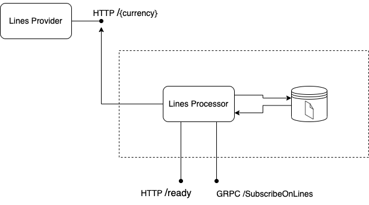

# Currency Lines Provider

## Описание

Реализовать сервис Lines Processor для обработки коэффициентов различных валют.

## Требования

- Для выполнения задания необхоидмо развернуть сервис Lines Provider c помощью Docker-образа или standalone-приложения.

### Технологии:

Определенных требований нет, можете использовать любые технологии, которые посчитаете нужными для выполнения задачи, ниже представлены рекомендуемые:
- Node.js/C#/Go;
- NestJS/ExpressJS/.NET;
- PostgreSQL/MongoDB/Redis;
- HTTP/gRPC;
- Kubernetes/Docker.

### Ссылки:

- Образ с сервисом lines-provider: https://hub.docker.com/r/yuriyvorobyov96/lines-provider;
- Репозиторий с сервисом: https://github.com/YuriyVorobyov96/backend-test-tasks/blob/main/currency-lines-provider/lines-provider/.

## Задание

Необходимо реализовать сервис __Lines Processor__, работающий с сервисом __Lines Provider__ и хранилищем данных.



### Компоненты

#### 1. Lines Provider

<details>
<summary>Описание</summary>

Позволяет получать некие коэффициенты (линии) для трёх валют: рубли, доллары, евро.

##### Запуск
Запуск через docker

```bash
$ docker run -dp 8000:8000 yuriyvorobyov96/lines-provider
```

Запуск через node

```bash
$ npm start
```
##### Машрутизация

```bash
$ curl http://localhost:8000/rub
{"lines":{"rub":"0.953"}}

$ curl http://localhost:8000/usd
{"lines":{"usd":"1.472"}}

$ curl http://localhost:8000/eur
{"lines":{"eur":"3.213"}}
```

</details>


#### 2. Lines Processor

<details>
<summary>Описание</summary>

Сервис, который необходимо реализовать.

##### Алгоритм работы:

1. На старте приложение запускает воркеры для каждой валюты, работающие в "фоновом" режиме
и выполняющие следующие действия:
- Раз в N секунд сходить в Lines Provider за линией для данной валюты (спуллить её);
- Сохранить значение линии в хранилище;
- Интервал N может быть свой для каждой валюты.
2. Приложение должно предоставлять два вида API:
- HTTP, с маршрутом /ready. Маршрут проверяет соединение к хранилищу, а также
говорит о том, что прошла первая синхронизация линий.

    Отвечает 200 OK или не-200 статусом. При желании может возвращать JSON с более
    детальной информацией о состоянии приложения.

- gRPC, с единственным методом /SubscribeOnLines. Метод отвечает за подписку на
линии для указанных видов валют. Является полнодуплексным (bidirectional streaming
RPC).

    В запросе - список валют и с какой периодичностью получать линии, в первом ответе -
    линии по ним, в последующих - дельты от того, что уже было отправлено.
    Если последующие запросы в стриме содержат изменение списка спортов, то снова
    присылаем линии полностью. Линии берутся из хранилища, обращений к Lines Provider быть не должно.

    Пример на псевдоязыке:

    ```bash
    Full-duplex stream:
    10:00:00 > /SubscribeOnLines [rub, eur] 3s
    10:00:00 < {rub: 1.131, eur: 2.192}
    10:00:03 < {rub: 0.03, eur: 0.012}

    10:00:07 > /SubscribeOnLines [usd, eur] 1s
    10:00:07 < {usd: 0.012, eur: 2.123}
    10:00:08 < {usd: 0.026, eur: 4.202}
    10:00:09 < {usd: 5.999, eur: 0.032}

    10:00:09 > /SubscribeOnLines [usd, rub] 5s
    10:00:09 < {usd: 2.404, rub: 1.988}
    10:00:14 < {usd: 0.124, rub: 0.013}
    10:00:19 < {usd: 0.111, rub: 0.038}
    ```

Protobuf-спецификации запроса и ответов, а также их формат необходимо разработать
самостоятельно.

HTTP API доступно сразу, но gRPC с того момента, как прошла первая синхронизация
стораджей (/ready стала возвращать 200 OK).

</details>

#### 3. Хранилище Lines Processor

<details>
<summary>Описание</summary>

Хранилище может быть как нереляционного типа (например, Redis), так и реляционного (например,
PostgreSQL), на выбор разработчика.
Каждая валюта должна быть представлена собственным ключом/таблицей (в зависимости от типа
хранилища).

</details>

